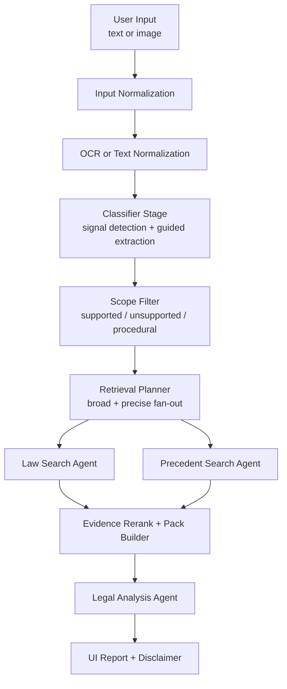

# 한국어 법률 분석 서비스 아키텍처

## 1. 문서 목적

이 문서는 현재 저장소에서 실제로 따라야 하는 **서비스 런타임 아키텍처와 데이터 계약**을 정의한다.

역할은 아래와 같다.

- [project.md](C:\Project\koreanlaw\project.md) 의 방향을 실행 계약으로 번역한다.
- 현재 runtime이 무엇을 주고받아야 하는지 명시한다.
- mock-first 구조를 유지하면서 live provider 전환을 준비한다.

## 2. 제품 목표

서비스는 아래 결과를 만든다.

- 법적으로 중요한 사실관계 요약
- 현재 서비스 범위 안의 주요 쟁점
- 관련 법령
- 관련 판례
- 참고용 분석 리포트

항상 지켜야 할 원칙:

- 결과는 참고용이다.
- 비전문가용 요약을 포함한다.
- 면책 문구를 포함한다.

## 3. 서비스 스코프

현재 우선 지원 이슈:

- 명예훼손
- 협박/공갈
- 모욕
- 개인정보 유출
- 스토킹
- 사기

원칙:

- 이 6개는 서비스 스코프이지 전체 법률 ontology가 아니다.
- 범위 밖 이슈는 조용히 삭제하지 않는다.
- `unsupported`, `procedural-heavy`, `insufficient-facts` 상태를 명시한다.

## 4. 핵심 설계 결정

### 4.1 채택하는 중심 구조

`raw input -> signal detection -> guided extraction -> Scope Filter -> retrieval -> evidence pack -> grounded analysis`

### 4.2 버리는 구조

- hard category router
- retrieval 없이 결론을 강하게 생성하는 end-to-end 구조
- 법률 지식을 파라미터에 통째로 의존하는 구조

### 4.3 유지하는 런타임 외형

기존 6-agent 외형은 유지한다.

- Orchestrator
- OCR Agent
- Classifier Agent
- Law Search Agent
- Precedent Search Agent
- Legal Analysis Agent

단, `Classifier Agent` 의 의미는 아래로 바뀐다.

- signal detection
- guided extraction
- legal element hint 생성
- retrieval query hint 생성
- legal element signal을 precise query fan-out에 반영

### 4.4 Scope Filter는 독립 개념이지만 반드시 top-level stage일 필요는 없다

`Scope Filter` 는 앞으로 canonical 용어로 사용한다.

다만 현재 저장소 기준에서는 아래 둘 다 가능하다.

- classifier 결과 안의 logical substep으로 구현
- retrieval planner 내부의 scope normalization 단계로 재사용

중요한 것은 이름보다 계약이다.
현재 구현은 classifier에서 1차 scope draft를 만들고, retrieval planner에서 같은 축으로 normalize한다. 따라서 다이어그램의 Scope Filter는 별도 HTTP agent가 아니라 logical layer다.

### 4.5 Evidence Rerank도 logical layer로 본다

`Evidence Rerank` 는 retrieval 이후 후보를 다시 정렬하는 논리 계층이다.

현재 문서 기준에서는:

- 필수 개념이다
- 하지만 runtime top-level stage를 무조건 늘린다는 뜻은 아니다

## 5. 전체 흐름



## 6. 설계 원칙

### 6.1 입력은 raw로 받는다

- 입력을 초반에 하나의 카테고리로 강제 분기하지 않는다.
- 원문 텍스트와 OCR 결과를 최대한 보존한다.

### 6.2 retrieval 중심으로 설계한다

- retrieval은 법률 근거 계층이다.
- 최종 분석은 retrieval 이후에만 강해진다.
- snippet / paragraph / clause 단위 근거를 우선한다.

### 6.3 mock-first를 유지한다

- API 키가 없는 동안 외부 호출을 기본 경로로 추가하지 않는다.
- mock provider와 live provider는 동일한 shape를 유지한다.

### 6.4 privacy와 disclaimer는 제거 금지다

- 개인정보 마스킹
- 업로드 후 삭제
- guest quota
- abuse control
- disclaimer

위 규칙은 기능 추가 시 제거하지 않는다.

## 7. 런타임 에이전트 계약

### 7.1 Orchestrator

책임:

- 분석 요청 수신
- job 생성 및 상태 관리
- OCR -> classifier -> retrieval -> analysis 순서 제어
- law / precedent 병렬 실행
- timeline 이벤트 기록
- internal runtime result assembly
- text/image/link 입력 분기와 auth/profile/quota context 조립은 request-context helper가 담당
- public/store/debug payload projection은 dedicated builder/privacy layer가 담당

입력:

- 사용자 분석 요청

출력:

- meta
- timeline
- ocr
- classification
- retrieval_plan
- law_search
- precedent_search
- legal_analysis

### 7.2 OCR Agent

책임:

- 이미지 입력이면 OCR 수행
- 텍스트 입력이면 normalization
- 후단 추론용 raw source shape 유지

반드시 유지할 필드:

- `source_type`
- `utterances`
- `raw_text`

계약:

```json
{
  "source_type": "community|game_chat|messenger|other",
  "utterances": [
    { "speaker": "A", "text": "..." }
  ],
  "raw_text": "..."
}
```

### 7.3 Classifier Agent

실제 구현 흐름 (`classifier-agent.mjs` + `guided-extraction-agent.mjs`):

1. **Signal Detection** — `buildClassifierFacts()` 로 rule-based 구조 신호 추출  
   - 금전 거래 구조, 반복 접촉 패턴, 협박 문구 구조 등  
   - 출력은 LLM 입력 hint용 `signalHints`. **분류기가 아님** (recall 우선, 틀려도 보정됨)

2. **Guided Extraction** — `runGuidedExtractionAgent()` 로 OpenAI 호출  
   - 모델: `gpt-5-nano` (env: `OPENAI_CLASSIFIER_MODEL`)  
   - timeout: 45 s, max_input: 4,000 chars, max_output: 900 tokens  
   - reasoning effort는 기본 `minimal`이며, 필요하면 `OPENAI_CLASSIFIER_REASONING_EFFORT`로 조정  
   - 신조어 / 초성 / 비꼼 / 우회표현은 키워드 없어도 **의미로 판단** (system prompt 명시)  
   - `mode: "openai"` 성공 시 LLM 결과 우선 사용

3. **Rule Fallback** — OpenAI 실패 또는 `OPENAI_CLASSIFIER_ENABLED=0` 시  
   - `buildRuleBasedIssueHypotheses()` 키워드 기반 점수 산정  
   - `mode: "rule_fallback"` 로 기록

mode 추적 필드:

- `extraction.mode`: `"openai"` | `"rule_fallback"`
- `extraction.model`: 사용된 모델명 또는 `null`
- `extraction.used_llm`: OpenAI 결과 사용 여부
- `extraction.warning`: fallback 사유 메시지

LLM output 계약:

```json
{
  "facts": {
    "public_exposure": true,
    "direct_message": false,
    "repeated_contact": false,
    "threat_signal": false,
    "money_request": false,
    "personal_info_exposed": false,
    "insulting_expression": false,
    "family_directed_insult": false,
    "slang_or_obfuscated_expression": true,
    "false_fact_signal": true,
    "target_identifiable": true,
    "procedural_signal": false,
    "unsupported_issue_signal": false,
    "abusive_expression_types": [],
    "semantic_signals": ["명예훼손"],
    "detected_keywords": ["허위사실", "유포"]
  },
  "issue_hypotheses": [
    { "type": "명예훼손", "confidence": 0.82, "matched_terms": ["허위사실", "유포"], "reason": "공연성 + 허위사실 적시" }
  ],
  "legal_elements": [
    {
      "issue_type": "명예훼손",
      "element_signals": ["public_disclosure", "fact_assertion", "falsity_signal", "target_identifiable"],
      "reason": "공연성, 사실 적시, 허위성, 특정성 신호가 모두 보임"
    }
  ],
  "query_hints": {
    "broad": ["명예훼손"],
    "precise": ["명예훼손 허위사실 공연성 카카오톡 단톡방"],
    "law": { "broad": ["명예훼손"], "precise": ["정보통신망법 명예훼손"] },
    "precedent": { "broad": ["명예훼손"], "precise": ["카카오톡 단톡방 명예훼손 판례"] }
  },
  "warnings": []
}
```

책임 요약:

- rule-based signal detection (signalHints 생성)
- LLM guided extraction (의미 기반 사실 추출)
- issue hypotheses 생성
- legal elements 추정
- retrieval query hint 생성 (broad + precise)
- 초안 scope flags 생성

필수 호환 필드:

- `issues`
- `is_criminal`
- `is_civil`
- `searchable_text`

확장 필드:

- `signals`
- `issue_hypotheses`
- `legal_elements`
- `query_hints`
- `supported_issues`
- `unsupported_issues`
- `scope_warnings`
- `scope_flags`

classifier 최종 출력 예시:

```json
{
  "issues": [
    {
      "type": "명예훼손",
      "severity": "high",
      "keywords": ["허위사실", "유포"],
      "law_search_queries": ["명예훼손", "허위사실 적시"],
      "charge_label": "사이버 명예훼손"
    }
  ],
  "signals": {
    "명예훼손": 0.82
  },
  "issue_hypotheses": [
    {
      "type": "명예훼손",
      "confidence": 0.82,
      "matched_terms": ["허위사실", "유포"],
      "supported": true
    }
  ],
  "legal_elements": {
    "명예훼손": {
      "public_disclosure": true,
      "fact_assertion": true,
      "falsity_signal": true,
      "target_identifiable": true
    }
  },
  "query_hints": {
    "broad": ["명예훼손"],
    "precise": ["명예훼손 허위사실 공연성 카카오톡 단톡방"]
  },
  "scope_flags": {
    "proceduralHeavy": false,
    "insufficientFacts": false,
    "unsupportedIssuePresent": false
  },
  "is_criminal": true,
  "is_civil": true,
  "searchable_text": "..."
}
```

### 7.4 Scope Filter

Scope Filter는 별도 logical 단계다.

역할:

- classifier와 keyword verify 모두 fact-aware scope 판정을 사용
- unsupported issue 표시
- procedural-heavy 판정
- insufficient-facts 판정
- 사용자 경고 메시지 생성

중요:

- unsupported issue를 조용히 삭제하지 않는다.
- retrieval 전부를 바로 중단하는 하드 게이트로 쓰지 않는다.
- best-effort retrieval은 허용하되 confidence와 표현을 조정한다.

대표 결과 shape:

```json
{
  "scope_flags": {
    "proceduralHeavy": false,
    "insufficientFacts": false,
    "unsupportedIssuePresent": true
  },
  "unsupported_issues": ["업무방해"],
  "scope_warnings": [
    "현재 서비스 범위 밖 이슈가 포함될 수 있습니다."
  ]
}
```

### 7.5 Retrieval Planner

책임:

- broad query 생성
- precise query 생성
- law / precedent bucket 생성
- warning과 scope flag를 함께 전달

필수 출력:

- `candidateIssues`
- `broadLawQueries`
- `preciseLawQueries`
- `broadPrecedentQueries`
- `precisePrecedentQueries`
- `lawQueries`
- `precedentQueries`
- `warnings`
- `scopeFlags`

원칙:

- broad query만으로 끝내지 않는다.
- precise query만으로 끝내지 않는다.
- broad + precise fan-out을 기본으로 한다.

### 7.6 Law Search Agent

책임:

- planner가 만든 law query를 provider에 전달
- 법령 candidate 회수
- preview / trace 생성

원칙:

- thin wrapper로 유지한다.
- provider 분기는 retrieval runtime / adapter 계층에서 처리한다.

### 7.7 Precedent Search Agent

책임:

- planner가 만든 precedent query를 provider에 전달
- 판례 candidate 회수
- preview / trace 생성

원칙:

- thin wrapper로 유지한다.

### 7.8 Evidence Rerank / Evidence Pack

논리 계층 역할:

- retrieval candidate를 다시 정렬
- 법령 snippet / 판례 snippet을 query-aware clause 후보 기준으로 선별
- evidence pack 구성

권장 신호:

- lexical overlap
- legal element overlap
- metadata
- late interaction / cross-encoder 계열 점수

하지만 특정 모델 이름은 계약이 아니라 구현 선택이다.

### 7.9 Legal Analysis Agent

책임:

- classification + law + precedent + evidence pack 통합
- grounded summary 생성
- issue card / reference card 생성
- disclaimer 포함

원칙:

- 근거가 약하면 강한 결론을 내리지 않는다.
- unsupported / procedural-heavy / insufficient-facts 입력은 한계를 명시한다.

## 8. HTTP 계약

### 8.1 분석 요청

- `POST /api/analyze`
- 응답: `202 Accepted`

반환 필드:

- `job_id`
- `stream_url`
- `result_url`
- guest quota 정보

### 8.2 진행 이벤트

- `GET /api/analyze/:job_id/stream`

최소 이벤트 타입:

- `agent_start`
- `agent_done`
- `complete`
- `error`

원칙:

- SSE는 internal runtime event를 그대로 노출하지 않는다.
- public-safe stream event contract로 projection한 뒤 전송한다.
- `/api/analyze/:job_id/stream` public contract는 HTTP 레벨 테스트로 고정한다.

### 8.3 최종 결과 조회

- `GET /api/analyze/:job_id`

최소 포함 필드:

- `meta`
- `ocr`
- `classification`
- `retrieval_plan`
- `law_search`
- `precedent_search`
- `legal_analysis`

## 9. 결과 데이터 계약

### 9.1 OCR Result

```json
{
  "source_type": "community|game_chat|messenger|other",
  "utterances": [
    { "speaker": "A", "text": "..." }
  ],
  "raw_text": "..."
}
```

### 9.2 Retrieval Result

retrieval 결과는 아래 artifact를 가진다.

- `preview`
- `trace`
- `evidence_pack`
- `reference_library`

위 artifact는 runtime의 internal 결과물이다.
외부 HTTP 응답에 어떤 artifact를 포함할지는 projection builder/privacy layer가 결정한다.

### 9.3 Preview / Trace / Evidence Pack 경계

#### preview

- UI 요약 카드용
- 빠르게 볼 수 있는 최소 정보만 포함

#### trace

- 디버그 / replay / query 검증용
- 사용자 공개 응답과 분리 가능

#### evidence_pack

- 최종 analysis가 직접 참조하는 최소 근거 묶음
- snippet / clause / paragraph 중심
- v2에서는 `citation_map`으로 analysis statement path와 reference/snippet/query_refs를 연결

## 10. Mock / Live 구조

### 10.1 Mock

보장해야 하는 것:

- fixture shape와 live shape 동일
- deterministic 동작
- preview / trace / evidence_pack 검증 가능

### 10.2 Live

원칙:

- provider만 교체
- stage 계약은 유지
- fixture shape를 먼저 깨지지 않게 유지
- live provider가 명시적으로 주입되기 전에는 `LAW_PROVIDER=live`만으로 네트워크를 호출하지 않는다.
- live 요청이 있어도 provider 미주입이면 `live_fallback`으로 fixture 결과를 사용한다.

## 10.3 OpenAI Provider (Classifier / Guided Extraction)

현재 Guided Extraction에서 사용하는 LLM provider 계약.

환경 변수:

| 변수 | 기본값 | 설명 |
|---|---|---|
| `OPENAI_API_KEY` | (필수) | OpenAI API 키 |
| `OPENAI_CLASSIFIER_ENABLED` | `1` | `0`이면 rule_fallback 모드 강제 |
| `OPENAI_CLASSIFIER_MODEL` | `gpt-5-nano` | 사용할 모델명 |
| `OPENAI_CLASSIFIER_TIMEOUT_MS` | `45000` | API 호출 timeout (ms) |
| `OPENAI_CLASSIFIER_MAX_INPUT_CHARS` | `4000` | LLM 입력 최대 글자 수 |
| `OPENAI_CLASSIFIER_MAX_OUTPUT_TOKENS` | `900` | LLM 출력 최대 토큰 수 |
| `OPENAI_CLASSIFIER_REASONING_EFFORT` | `minimal` | Responses API `reasoning.effort`; GPT-5 계열은 출력 안정성과 비용 때문에 `minimal`부터 시작 |

권장 사항:

- 기본 `900` tokens로 시작하고, 실제 LLM JSON 누락이 관측될 때만 `1200~1500`으로 올린다.
- 모델 운영 순서 (권장): 기본 `gpt-5-nano`, 필요 시 수동으로 `gpt-4o-mini` 또는 더 강한 모델로 변경, 실패 시 `rule_fallback`.
- OpenAI 호출 실패 시 `mode: "rule_fallback"`으로 graceful degradation.

원칙:

- `OPENAI_CLASSIFIER_ENABLED=0`이거나 API 키가 없으면 네트워크 호출을 시도하지 않는다.
- mock-first 원칙과 충돌하지 않는다 — rule_fallback 자체가 동작하는 경로다.
- live law/precedent provider와 독립적이다 (classifier용 OpenAI ≠ retrieval provider).

## 11. Privacy / Security / Abuse Control

반드시 유지할 규칙:

- OCR 원문 저장 최소화
- 저장/공개 payload sanitization
- guest quota IP 기준 제어
- 신뢰 프록시 미설정 시 `x-forwarded-for` 미신뢰
- disclaimer 포함
- persist payload shaping은 helper/builder가 담당

내부와 외부는 분리한다.

- internal trace
- public preview
- internal evidence provenance
- public evidence summary

## 12. 구현 우선순위

### Phase A

- Signal Detection 고정
- Guided Extraction 고정
- Scope Filter 개념 정리
- broad / precise retrieval plan 정리

### Phase B

- evidence pack 강화
- rerank 강화
- grounded analysis 정리
- public / store / debug 경계 정리

### Phase C

- verifier / calibration 계층 도입
- unsupported / procedural handling 강화
- retrieval와 generation 평가 분리

### Phase D

- OCR 업그레이드 실험
- diffusion verifier 도입 (arXiv:2502.09992 — LLaDA 기반)
  - **역할**: generator가 아닌 verifier — analysis 결과 문장이 evidence pack에 의해 실제로 지지되는지 채점
  - **입력**: `(analysis_statement, evidence_snippets)` 쌍
  - **출력**: support score + unsupported statement 목록
  - **적용 위치**: Legal Analysis Agent 후단 calibration 계층 (별도 runtime stage 추가 없음)
  - **주의**: Phase D는 연구 단계 — 현재 grounded analysis 계약을 깨지 않는 범위에서만 붙인다
- counterfactual 자동화 (evidence 제거 시 결론 변화 측정)

## 13. 금지사항

- hard category router
- unsupported issue 조용한 삭제
- retrieval 없는 강한 결론 생성
- agent별 live/mock 분기 중복
- privacy / disclaimer 제거

## 14. 요약

이 아키텍처의 핵심은 아래다.

- runtime stage 이름은 유지한다.
- classifier는 signal detection + guided extraction wrapper다.
- Scope Filter는 logical layer다.
- retrieval은 broad + precise fan-out이다.
- evidence pack 기반 grounded analysis를 수행한다.
- Judgment Core가 `can_sue`, `risk_level`, `evidence_strength`, `scope_assessment`, 추천 액션을 같은 판단 축으로 계산한다.
- keyword verification과 final analysis는 같은 guidance policy로 추천 액션과 수집 증거를 만든다.

한 줄 요약:

**이 서비스의 중심은 카테고리 분류가 아니라, 사실 추출과 근거 기반 retrieval이다.**
