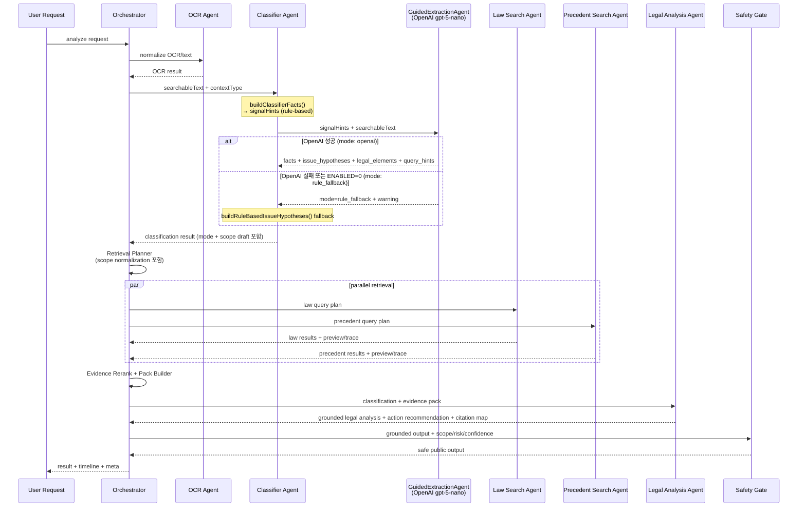

# Runtime Multi-Agent Contract

## 1. 문서 목적

이 문서는 저장소 안의 **서비스 런타임 에이전트 계약**을 정의한다.

특히 아래를 명확히 한다.

- 실제 runtime stage가 무엇인지
- logical substep이 무엇인지
- 각 stage가 어떤 입력과 출력을 가지는지
- preview / trace / evidence pack / citation 경계가 어떻게 나뉘는지
- mock-first 구조에서 live provider 전환을 어떻게 준비하는지

## 2. 용어 구분

### 2.1 Codex sub-agent

Codex sub-agent는 개발 분업용이다.

예:

- 코드 탐색
- 테스트 보강
- 문서 정리
- 리뷰 분업

이 문서의 주제가 아니다.

### 2.2 서비스 runtime agent

서비스 runtime agent는 실제 분석 파이프라인을 구성하는 stage다.

이 문서에서 말하는 `agent` 는 모두 이 의미다.

### 2.3 Logical substep

logical substep은 runtime top-level stage는 아니지만, 내부에서 반드시 거쳐야 하는 논리 단계다.

대표 예:

- Scope Filter
- Retrieval Planner
- Evidence Rerank
- Evidence Pack Builder

## 3. 현재 runtime stage

현재 런타임 stage 이름은 아래를 유지한다.

- `ocr`
- `classifier`
- `law`
- `precedent`
- `analysis`
- `orchestrator`

즉 **stage 이름은 늘리지 않는다.**

다만 내부 logical substep은 아래를 명시적으로 둔다.

- `Scope Filter`
- `Retrieval Planner`
- `Evidence Rerank`
- `Evidence Pack Builder`

## 4. 핵심 방향

runtime은 상위 구조로 아래 4개 계층을 따른다.

- Case Understanding
- Evidence Engine
- Legal Decision Engine
- Safety & Output Layer

세부 흐름은 아래 구조를 따른다.

`raw input -> ocr/text normalization -> classifier(signal detection + guided extraction) -> Scope Filter -> Retrieval Planner -> law/precedent retrieval -> Evidence Rerank -> Evidence Pack -> grounded analysis -> safety gate`

중요:

- `classifier`는 단순 카테고리 분류기가 아니다.
- `Guided Extraction`은 결론 엔진이 아니라 retrieval용 가설 생성기다.
- `Scope Filter`는 라우터가 아니라 후단 필터다.
- `Scope Filter`는 classifier의 1차 scope draft와 retrieval planner의 scope normalization에서 fact-aware 규칙을 재사용하는 logical layer다.
- `law`와 `precedent`는 thin wrapper다.
- `analysis`는 evidence pack을 기준으로 grounded output과 action recommendation을 만든다.
- 최종 사용자 노출 전에는 별도 `safety gate`가 과도한 단정과 누락된 경고를 점검한다.

## 5. 전체 실행 순서



## 6. Stage별 책임

### 6.1 Orchestrator

책임:

- 요청 수신
- job 생성 및 상태 관리
- stage 실행 순서 제어
- law / precedent 병렬 실행
- logical substep 실행
- timeline 이벤트 기록
- internal runtime result assembly
- text/image/link 입력 분기와 auth/profile/quota context 조립은 request-context helper가 담당
- public/store/debug payload projection은 builder/privacy layer가 담당
- persist payload shaping도 dedicated helper/builder가 담당

출력:

- meta
- timeline
- OCR result
- classification result
- retrieval plan
- law result
- precedent result
- evidence pack
- legal analysis

### 6.2 OCR Agent

책임:

- 이미지면 OCR 수행
- 텍스트면 normalization
- source_type / utterances / raw_text 보존

최소 계약:

```json
{
  "source_type": "community|game_chat|messenger|other",
  "utterances": [
    { "speaker": "A", "text": "..." }
  ],
  "raw_text": "..."
}
```

### 6.3 Classifier Agent

구현 파일: `classifier-agent.mjs` + `guided-extraction-agent.mjs`

실행 순서:

**Step 1 — Signal Detection** (`buildClassifierFacts()`):
- 구조 패턴 기반 rule-based 신호 탐지
- 금전 거래 구조, 반복 접촉 패턴, 협박 문구 구조 등
- 출력: `signalHints` — **LLM 입력 힌트, 분류 결론이 아님**
- recall 우선 탐지기 — 틀려도 downstream에서 보정됨

**Step 2 — Guided Extraction** (`runGuidedExtractionAgent()`):
- `signalHints` + `searchableText` + `contextType` → OpenAI 호출
- 신조어 / 초성 / 비꼼 / 우회표현은 키워드 없어도 **의미로 판단** (system prompt 명시)
- 성공 시 `mode: "openai"` — LLM issue_hypotheses 우선 사용
- 실패 시 `mode: "rule_fallback"` — `buildRuleBasedIssueHypotheses()` 키워드 fallback
- `OPENAI_CLASSIFIER_REASONING_EFFORT`는 기본 `minimal`로 Responses API `reasoning.effort`에 전달
- 이 단계는 **결론 생성기**가 아니라 **가설 생성기**다. 후단 retrieval와 verifier가 검증할 구조화 힌트를 만든다.

mode 추적:

```json
{
  "mode": "openai",
  "model": "gpt-5-nano",
  "used_llm": true,
  "warning": null
}
```

또는 fallback 시:

```json
{
  "mode": "rule_fallback",
  "model": "gpt-5-nano 또는 null",
  "used_llm": false,
  "warning": "OpenAI timeout: 45000ms exceeded"
}
```

LLM output 계약 (`guided-extraction-agent.mjs`):

```json
{
  "facts": {
    "public_exposure": true,
    "direct_message": false,
    "repeated_contact": false,
    "threat_signal": false,
    "money_request": false,
    "personal_info_exposed": false,
    "insulting_expression": false,
    "family_directed_insult": false,
    "slang_or_obfuscated_expression": true,
    "false_fact_signal": true,
    "target_identifiable": true,
    "procedural_signal": false,
    "unsupported_issue_signal": false,
    "abusive_expression_types": [],
    "semantic_signals": ["명예훼손"],
    "detected_keywords": ["허위사실", "유포"]
  },
  "issue_hypotheses": [
    {
      "type": "명예훼손",
      "confidence": 0.82,
      "matched_terms": ["허위사실", "유포"],
      "reason": "공연성 + 허위사실 적시"
    }
  ],
  "legal_elements": [
    {
      "issue_type": "명예훼손",
      "element_signals": ["public_disclosure", "fact_assertion", "falsity_signal", "target_identifiable"],
      "reason": "공연성, 사실 적시, 허위성, 특정성 신호가 모두 보임"
    }
  ],
  "query_hints": {
    "broad": ["명예훼손"],
    "precise": ["명예훼손 허위사실 공연성 카카오톡 단톡방"],
    "law": { "broad": ["명예훼손"], "precise": ["정보통신망법 명예훼손"] },
    "precedent": { "broad": ["명예훼손"], "precise": ["카카오톡 단톡방 명예훼손 판례"] }
  },
  "warnings": []
}
```

필수 호환 필드:

- `issues`
- `is_criminal`
- `is_civil`
- `searchable_text`

확장 필드:

- `signals`
- `issue_hypotheses`
- `legal_elements`
- `query_hints`
- `scope_flags`
- `supported_issues`
- `unsupported_issues`
- `scope_warnings`

### 6.4 Law Search Agent

책임:

- planner가 만든 law query bucket을 provider에 전달
- 법령 후보 수집
- preview / trace 생성

원칙:

- thin wrapper
- provider 분기 중복 금지

### 6.5 Precedent Search Agent

책임:

- planner가 만든 precedent query bucket을 provider에 전달
- 판례 후보 수집
- preview / trace 생성

원칙:

- thin wrapper

### 6.6 Legal Analysis Agent

책임:

- classification + evidence pack 통합
- grounded summary 생성
- issue card / reference card 생성
- action recommendation 생성
- disclaimer 포함

원칙:

- evidence가 약하면 강한 결론을 피한다.
- unsupported / procedural-heavy / insufficient-facts 한계를 드러낸다.
- 추천 액션도 evidence strength, risk, scope assessment와 같은 판단 축을 사용한다.

### 6.7 Safety Gate

책임:

- evidence sufficiency 확인
- citation integrity 확인
- unsupported / procedural / low-confidence 상황에서 표현 수위 조정
- 과도한 단정 억제
- 고위험 상황에서 전문가 상담 권고 누락 여부 점검

원칙:

- analysis 출력이 그대로 public output이 되지 않는다.
- safety gate를 통과한 결과만 사용자에게 노출한다.

## 7. Logical substep 계약

### 7.1 Scope Filter

역할:

- classifier facts와 lightweight inferred facts를 함께 사용
- unsupported issue 표시
- procedural-heavy 판정
- insufficient-facts 판정
- scope warning 생성

중요:

- unsupported issue를 조용히 삭제하지 않는다.
- retrieval을 무조건 중단하는 하드 게이트로 쓰지 않는다.

shape 예시:

```json
{
  "scope_flags": {
    "proceduralHeavy": false,
    "insufficientFacts": false,
    "unsupportedIssuePresent": true
  },
  "unsupported_issues": ["업무방해"],
  "scope_warnings": [
    "현재 서비스 범위 밖 이슈가 포함될 수 있습니다."
  ]
}
```

### 7.2 Retrieval Planner

역할:

- broad query 생성
- precise query 생성
- law / precedent bucket 생성
- warning과 scope flag 전달

shape 예시:

```json
{
  "candidateIssues": [],
  "broadLawQueries": [],
  "preciseLawQueries": [],
  "broadPrecedentQueries": [],
  "precisePrecedentQueries": [],
  "lawQueries": [],
  "precedentQueries": [],
  "warnings": [],
  "scopeFlags": {
    "proceduralHeavy": false,
    "insufficientFacts": false,
    "unsupportedIssuePresent": false
  }
}
```

### 7.3 Evidence Rerank

역할:

- retrieval 후보 재정렬
- query-aware snippet / clause / paragraph 중요도 산정
- legal element와 candidate 정합성 반영

권장 신호:

- lexical overlap
- metadata
- legal element overlap
- strong reranker 또는 late interaction 계열 점수

주의:

- 특정 모델 이름은 runtime 계약이 아니라 구현 선택이다.

### 7.4 Evidence Pack Builder

역할:

- 최종 analysis가 직접 참조할 근거 묶음 생성
- `retrieval_trace.query_refs`로 query provenance를 구조화 필드로 보존

포함 항목:

- selected snippets
- reference ids
- top issue 연결 정보
- evidence strength
- `citation_map` v2
- analysis statement path와 reference/snippet/query_refs 연결

## 8. 결과 artifact 경계

### 8.1 Preview

용도:

- UI 요약 카드
- 사용자가 빠르게 보는 top issue / top law / top precedent

원칙:

- 디버그 정보는 넣지 않는다.

### 8.2 Trace

용도:

- 디버그
- replay
- query plan 검증

포함 가능 항목:

- tool 이름
- provider
- duration
- input/output ref
- reasoning note

### 8.3 Evidence Pack

용도:

- 최종 analysis의 직접 근거

원칙:

- 문서 전체가 아니라 최소 근거 단위 중심
- `citation_map.version`은 v2이며, statement path 기준으로 charge / precedent card와 근거를 연결한다.

### 8.4 Citation Map

용도:

- analysis 문장과 reference id 연결

원칙:

- 가능한 한 analysis 단계에서 reference ids와 함께 유지한다.
- `by_reference_id`와 `by_statement_path` 인덱스를 함께 유지한다.

## 9. Timeline 이벤트 계약

최소 이벤트 타입:

- `agent_start`
- `agent_done`
- `complete`
- `error`

권장 필드:

- `agent`
- `timestamp`
- `duration_ms`
- `status`
- `summary`

선택적 필드:

- `substep`
- `scope_warning`

중요:

- top-level timeline stage 이름은 그대로 유지한다.
- logical substep이 필요하면 `substep` 필드로 기록한다.
- public SSE는 internal event를 그대로 내보내지 않고 sanitized event contract로 projection한다.
- `/api/analyze/:job_id/stream` public contract는 HTTP 레벨 회귀 테스트로 유지한다.

## 10. Retrieval runtime과의 경계

retrieval 핵심 로직은 agent가 아니라 runtime/tool layer에 둔다.

대표 파일:

- [C:\Project\koreanlaw\apps\api\src\retrieval\planner.ts](C:\Project\koreanlaw\apps\api\src\retrieval\planner.ts)
- [C:\Project\koreanlaw\apps\api\src\retrieval\tools.ts](C:\Project\koreanlaw\apps\api\src\retrieval\tools.ts)
- [C:\Project\koreanlaw\apps\api\src\retrieval\mcp-adapter.ts](C:\Project\koreanlaw\apps\api\src\retrieval\mcp-adapter.ts)
- [C:\Project\koreanlaw\apps\api\src\retrieval\service.ts](C:\Project\koreanlaw\apps\api\src\retrieval\service.ts)

agent가 하는 일:

- 입력 전달
- 결과 래핑
- preview / trace / evidence pack 노출

runtime이 하는 일:

- broad/precise query planning
- adapter 호출
- candidate normalization
- preview 조합
- trace 조합
- evidence rerank
- evidence pack 생성

## 11. Mock / Live 계약

### 11.1 Mock mode

보장해야 하는 것:

- fixture shape와 live shape 동일
- deterministic 동작
- preview / trace / evidence pack 검증 가능

### 11.2 Live mode

원칙:

- provider만 교체
- stage 인터페이스 유지
- fixture shape를 먼저 깨지 않게 유지
- live provider가 명시적으로 주입될 때만 외부 API를 호출
- live mode가 요청됐지만 provider가 주입되지 않으면 `live_fallback`으로 fixture를 사용

provider source:

- `fixture`: mock-first fixture 결과
- `live`: 명시적으로 주입된 live provider 결과
- `live_fallback`: live 요청이 있었지만 live provider 미주입으로 fixture fallback

중요:

- `LAW_PROVIDER=live` 값만으로 retrieval adapter가 네트워크를 호출하지 않는다.
- law.go.kr 연동은 `RetrievalLiveProvider` seam을 구현해 adapter에 주입하는 방식으로 붙인다.
- adapter는 live 결과도 `LawDocumentRecord` / `PrecedentDocumentRecord`와 `retrieval_evidence` shape로 normalize한다.

## 11.3 OpenAI Provider (Classifier / Guided Extraction)

Guided Extraction에서 사용하는 LLM provider 계약.

환경 변수:

| 변수 | 기본값 | 설명 |
|---|---|---|
| `OPENAI_API_KEY` | (필수) | OpenAI API 키 |
| `OPENAI_CLASSIFIER_ENABLED` | `1` | `0`이면 rule_fallback 강제 |
| `OPENAI_CLASSIFIER_MODEL` | `gpt-5-nano` | 사용 모델 |
| `OPENAI_CLASSIFIER_TIMEOUT_MS` | `45000` | API timeout (ms) |
| `OPENAI_CLASSIFIER_MAX_INPUT_CHARS` | `4000` | 입력 글자 수 상한 |
| `OPENAI_CLASSIFIER_MAX_OUTPUT_TOKENS` | `900` | 출력 토큰 상한 |
| `OPENAI_CLASSIFIER_REASONING_EFFORT` | `minimal` | GPT-5 계열 출력 안정성과 비용 절감을 위해 `minimal`부터 시작 |

권장 사항:

- 기본 `900` tokens로 시작하고, 실제 LLM JSON 누락이 관측될 때만 `1200~1500`으로 올린다.
- 모델 운영 순서 (권장): 기본 `gpt-5-nano`, 필요 시 수동으로 `gpt-4o-mini` 또는 더 강한 모델로 변경, 실패 시 `rule_fallback`.
- API 실패 시 `mode: "rule_fallback"` graceful degradation 보장.
- OpenAI 키 없이도 rule_fallback 경로는 동작 — mock-first 원칙과 충돌하지 않는다.

이 provider는 retrieval용 law/precedent provider와 독립적이다:

- Classifier OpenAI provider: `OPENAI_API_KEY` 기반
- Retrieval provider: `LAW_PROVIDER` + `RetrievalLiveProvider` seam 기반

## 12. Privacy / Security / Abuse Control

반드시 유지할 규칙:

- OCR 원문 저장 최소화
- public/store/debug 경계 분리
- guest quota IP 기준 제어
- 신뢰 프록시 미설정 시 `x-forwarded-for` 미신뢰
- disclaimer 포함

분리 원칙:

- internal trace vs public preview
- internal provenance vs public evidence summary

## 13. 금지사항

- hard category router
- scope_filter 결과를 조용한 삭제에 사용
- retrieval 없는 강한 결론 생성
- agent별 live/mock 분기 중복
- privacy / disclaimer 제거

## 14. 요약

이 runtime contract의 핵심은 아래다.

- stage 이름은 유지한다.
- 상위 구조는 Case Understanding / Evidence Engine / Legal Decision Engine / Safety & Output Layer로 본다.
- classifier는 signal detection + guided extraction wrapper다.
- Guided Extraction은 retrieval용 가설 생성기다.
- Scope Filter, Retrieval Planner, Evidence Rerank는 logical substep이다.
- law / precedent는 thin wrapper다.
- evidence pack 중심 grounded analysis와 action recommendation을 수행한다.
- Judgment Core가 `can_sue`, `risk_level`, `evidence_strength`, `scope_assessment`, 추천 액션을 같은 판단 축으로 계산한다.
- keyword verification과 final analysis는 공용 guidance policy로 추천 액션과 수집 증거를 생성한다.
- 최종 public output 전에는 safety gate가 한 번 더 검증한다.

한 줄 요약:

**runtime stage 이름은 늘리지 않되, 내부 logical substep과 safety gate를 명시하고 evidence pack 중심 grounded analysis를 수행한다.**
