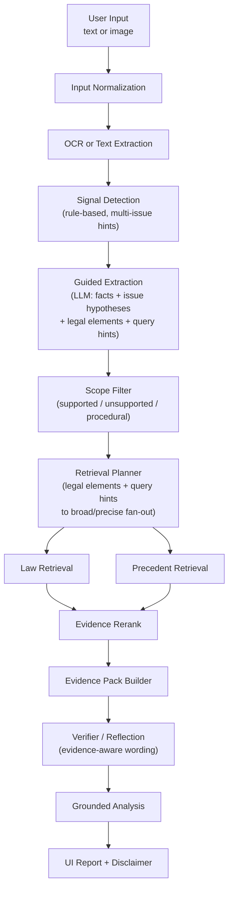

# Project Direction

## 1. 문서 목적

이 문서는 현재 저장소의 전체 프로젝트 방향을 정리한 **목표 아키텍처 제안서**다.

이 문서가 하는 일은 세 가지다.

- 이 프로젝트가 실제로 해결하려는 문제를 다시 정의한다.
- 무엇을 메인 구조로 채택하고 무엇을 버릴지 결정한다.
- [ARCHITECTURE.md](C:\Project\koreanlaw\ARCHITECTURE.md) 와 [docs/multi-agent-runtime.md](C:\Project\koreanlaw\docs\multi-agent-runtime.md) 를 어떤 기준으로 정렬할지 정한다.

이 문서는 구현과 무관한 공상 문서가 아니다. 최신 legal RAG 흐름, 현재 저장소의 mock-first 제약, 현재 코드 구조를 같이 고려한 방향 문서다.

## 2. 프로젝트를 한 줄로 다시 정의하면

이 프로젝트는 “법을 다 외운 챗봇”이 아니다.

정확한 정의는 아래다.

- 입력은 한국어 자유서술 텍스트 또는 대화 캡처 이미지다.
- 시스템은 입력에서 법적으로 중요한 사실을 추출한다.
- 추출된 사실을 바탕으로 관련 법령과 판례를 검색한다.
- 검색된 근거를 바탕으로 참고용 분석 리포트를 생성한다.
- 결과에는 항상 근거와 면책 문구가 포함된다.

핵심은 `사실 추출 + retrieval + grounded analysis` 이다.

## 3. 이 프로젝트가 아닌 것

이 프로젝트는 아래 목표를 지향하지 않는다.

- 법률 지식을 파라미터에 통째로 암기한 생성기
- 입력 초반에 하나의 카테고리로 강제 라우팅하는 시스템
- retrieval 없이 고소 가능성이나 처벌을 단정하는 시스템
- 법률 전문가를 완전히 대체하는 시스템

## 4. 서비스 스코프와 법률 전체를 분리해야 한다

현재 서비스가 우선 다루는 이슈는 아래 6개다.

- 명예훼손
- 협박/공갈
- 모욕
- 개인정보 유출
- 스토킹
- 사기

하지만 이 6개는 전체 법률 ontology가 아니라 **현재 서비스 스코프**다.

실제 입력에는 아래가 같이 섞여 들어올 수 있다.

- 강요
- 업무방해
- 통신매체이용음란
- 불법촬영물 유포
- 정보통신망법 별도 쟁점
- 절차법 중심 사건
- 단순 민사 분쟁
- 기타 범위 밖 이슈

따라서 시스템은 처음부터 입력을 6개 카테고리 중 하나로 강제 분류하면 안 된다.

정확한 운영 원칙은 아래다.

- 내부 추론 공간은 더 넓게 유지한다.
- 사용자에게 우선 노출하는 출력만 6개 중심으로 정리한다.
- 범위 밖 이슈는 삭제하지 않고 `unsupported` 또는 `추가 검토 필요`로 표시한다.

## 5. 불변 설계 원칙

### 5.1 Signal Detection은 결론 엔진이 아니다

Signal Detection은 rule-based, recall 우선, 다중 신호 탐지기다.

역할:

- 빠르고 싼 hint 생성
- retrieval와 guided extraction의 출발점 제공

하지 않는 일:

- 최종 법적 결론 내리기
- 하나의 이슈로 확정 라우팅하기

### 5.2 Scope Filter는 라우터가 아니다

기존 문서에서 `Scope Mapping` 으로 부르던 개념은 앞으로 `Scope Filter` 로 통일한다.

중요:

- Scope Filter는 Guided Extraction **이후**에 작동한다.
- Scope Filter는 입력을 처음부터 한 갈래로 보내는 라우터가 아니다.
- Scope Filter는 `지원 범위`, `절차법 중심`, `사실관계 부족`, `unsupported` 여부를 표시하는 후단 필터다.

### 5.3 구성요건 체크리스트는 retrieval를 덜 엉뚱하게 만든다

구성요건 체크리스트는 retrieval 품질을 올리는 보조 장치다.

정확한 표현:

- retrieval 정밀도를 높일 수 있다
- query hint를 더 구체적으로 만들 수 있다
- legal element signal을 precise query fan-out에 연결할 수 있다

과장해서 말하면 안 되는 것:

- 체크리스트만으로 법적 판단을 보장한다
- checklist가 곧 결론이다

### 5.4 최종 분석은 반드시 grounded output 이어야 한다

최종 리포트는 retrieval 이후에만 강한 문장을 사용할 수 있다.

원칙:

- 근거가 약하면 강한 결론을 내리지 않는다.
- evidence가 부족하면 부족하다고 말한다.
- 범위 밖 이슈면 범위 밖이라고 말한다.

## 6. 채택하는 전체 구조

한 줄로 줄이면 이 구조다.

`raw input -> signal detection -> guided extraction -> Scope Filter -> retrieval -> rerank -> evidence pack -> grounded analysis`

HTTP 계층 원칙:

- HTTP handler는 인증, 상태, quota, job lifecycle만 담당한다.
- text/image/link 입력 분기와 auth/profile/quota context 조립은 request-context helper가 담당한다.
- public/store/debug payload projection은 dedicated builder/privacy layer가 담당한다.
- persist payload shaping도 dedicated helper/builder가 담당한다.
- SSE는 internal event를 그대로 내보내지 않고 public-safe event contract로 projection한다.
- `/api/analyze/:job_id/stream` public contract는 HTTP 레벨 테스트로 잠근다.

## 7. 단계별 구조

### 7.1 Input Normalization

여기서 하는 일:

- 파일 타입 확인
- text / image 분기
- 공백, 제어문자, 유니코드 정규화
- abuse control 기본 체크
- 원문 보존

원칙:

- 입력을 처음부터 카테고리화하지 않는다.
- `normalized_text` 와 `raw_preserved` 를 분리해서 다룬다.

### 7.2 OCR / Text Extraction

이미지 입력이면 OCR을 수행하고, 텍스트 입력이면 normalization 결과를 그대로 쓴다.

반드시 유지할 shape:

- `source_type`
- `utterances`
- `raw_text`

OCR 단계의 목표는 텍스트를 보기 좋게 꾸미는 것이 아니라, 후단 retrieval와 evidence alignment에 필요한 원문 구조를 보존하는 것이다.

### 7.3 Signal Detection

rule-based로 간다.

이 단계에서 만드는 것:

- 다중 이슈 힌트
- trigger token
- low-cost score

추천 특성:

- 낮은 threshold
- false negative보다 false positive를 허용
- 복합 입력을 허용

### 7.4 Guided Extraction

메인 LLM 호출은 여기에 둔다.

한 번의 호출에서 아래를 구조화한다.

- facts
- issue hypotheses
- legal elements
- query hints
- 초안 scope flags

예시 fact:

- 공개 범위
- 반복성
- 대상 특정 가능성
- 허위사실 적시 여부
- 모욕적 표현 여부
- 해악 고지 여부
- 금전 요구 여부
- 개인정보 포함 여부
- 추적/접촉 여부
- 성적 표현 여부

### 7.5 Scope Filter

Scope Filter는 **논리 단계**다. 메인 runtime stage 이름을 무조건 늘려야 한다는 뜻은 아니다.

역할:

- 지원 스코프 여부 판정
- classifier 경로와 keyword verify 경로 모두에서 facts 기반으로 같은 규칙 적용
- unsupported issue 표시
- procedural-heavy 판정
- insufficient-facts 판정

하지 않는 일:

- 이슈를 조용히 삭제하기
- retrieval 이전에 무조건 잘라내기

즉 best-effort 원칙을 유지하되, 후단에서 표현과 confidence를 조정하는 계층이다.

### 7.6 Retrieval Planner

planner는 broad query와 precise query를 동시에 만든다.

예:

- broad: `명예훼손`
- precise: `명예훼손 허위사실 공연성 카카오톡 단톡방`

law / precedent query는 병렬 fan-out을 전제로 한다.

### 7.7 Retrieval

retrieval은 hybrid 구조로 간다.

기본 원칙:

- sparse / lexical 계층으로 후보를 넓게 회수
- metadata와 query hint를 결합
- 문서 전체보다 clause / snippet / paragraph 단위 근거를 우선

### 7.8 Evidence Rerank

rerank는 logical layer다. 현재 코드에서 바로 runtime top-level stage로 드러낼 필요는 없다.

역할:

- lexical overlap
- legal element overlap
- metadata
- late interaction / cross-encoder 계열 점수
- query-aware snippet / clause selection 결과

를 결합해 candidate를 다시 정렬하는 것

### 7.9 Evidence Pack

evidence pack은 최종 analysis가 실제로 참조하는 최소 근거 묶음이다.

포함 항목:

- 선택된 법령 snippet
- 선택된 판례 snippet
- reference id
- issue 연결 정보
- evidence strength
- `citation_map` v2
- analysis statement path와 reference/snippet/query_refs 연결

### 7.10 Verifier / Reflection

이 계층은 retrieval와 analysis 사이에 들어가는 검증 계층이다.

역할:

- evidence sufficient 여부
- citation 정합성
- legal elements와 retrieval 결과의 모순 여부
- confidence calibration

### 7.11 Grounded Analysis

최종 분석은 아래 원칙을 따른다.

- retrieval 근거를 바탕으로만 강한 문장을 쓴다.
- unsupported / procedural / low-confidence 상황을 명시한다.
- 비전문가용 요약과 면책 문구를 포함한다.

## 8. 모델 전략

### 8.1 메인 전략

메인 전략은 아래 조합이다.

- rule-based signal detection
- LLM 기반 guided extraction
- hybrid retrieval
- rerank
- verifier
- grounded generation

### 8.2 category classifier 중심으로 가지 않는 이유

법률 문제는 문장 스타일 분류보다 구성요건 정합성이 중요하다.

따라서 중요한 것은 아래다.

- facts
- legal elements
- retrieval alignment

### 8.3 디퓨전은 어디에 넣는가

디퓨전은 메인 생성기로 바로 넣지 않는다.

현실적인 위치:

- retrieval 뒤의 latent verifier
- hard negative / counterfactual 생성

정리하면:

- `legal RAG first`
- `diffusion verifier second`

## 9. 2026 기준 기술 우선순위

### 9.1 지금 바로 가치가 큰 것

- clause-aware retrieval
- hybrid retrieval
- ColBERT 계열 late interaction 또는 strong reranker
- reasoning-enhanced query rewriting
- verifier / self-reflection
- retrieval evaluation

### 9.2 병행 연구 가치가 있는 것

- OCR 업그레이드
- diffusion-based legal verifier
- counterfactual generation

### 9.3 당장 메인으로 쓰기 이른 것

- full diffusion generator
- OCR-free end-to-end 법률 멀티모달 모델

## 10. 데이터 전략

학습 데이터의 목적은 법을 외우게 하는 것이 아니다.

진짜 목적:

- fact extraction 안정화
- query generation 개선
- rerank 보조 신호 개선
- verifier 학습

필요한 데이터셋 종류:

- approved gold
- hard negative
- counterfactual
- unsupported / procedural examples

## 11. 평가 전략

평가는 한 점수로 끝내지 않는다.

분리해서 본다.

- fact extraction accuracy
- issue hypothesis recall
- retrieval recall@k
- rerank precision
- grounded answer faithfulness
- scope handling correctness

## 12. 현재 repo에 맞는 현실적 적용

이 저장소는 이미 6-agent 외형을 갖고 있다.

이걸 버리지 않고 이렇게 바꾼다.

- Orchestrator: 유지
- OCR Agent: 유지
- Classifier Agent: 이름 유지, 역할 재정의
- Law Search Agent: 유지
- Precedent Search Agent: 유지
- Legal Analysis Agent: grounded analysis에 집중

즉 runtime stage 이름은 유지하되, 내부 logical substep을 강화한다.

## 13. 로드맵

### Phase A

- Signal Detection 도입
- Guided Extraction 구조 확정
- Scope Filter 개념 확정
- Planner를 broad / precise fan-out 구조로 정리

### Phase B

- Evidence pack 구축
- Rerank 구조 강화
- Grounded analysis 정리
- public / store / debug 경계 분리

### Phase C

- verifier / calibration 도입
- unsupported / procedural handling 강화
- retrieval 평가 자동화

### Phase D

- OCR 업그레이드 실험
- diffusion verifier 연구
- counterfactual synthesis 자동화

## 14. 문서 관계

이 문서는 방향 문서다.

실행 계약은 아래가 담당한다.

- [ARCHITECTURE.md](C:\Project\koreanlaw\ARCHITECTURE.md)
- [docs/multi-agent-runtime.md](C:\Project\koreanlaw\docs\multi-agent-runtime.md)

이 둘은 이 문서와 모순되면 안 된다.

## 15. 최종 요약

이 프로젝트는 더 이상 “카테고리 분류형 법률 챗봇”으로 가면 안 된다.

정확한 방향은 아래다.

- 입력은 raw로 받는다.
- Signal Detection으로 다중 이슈 힌트를 만든다.
- Guided Extraction으로 facts와 legal elements를 구조화한다.
- Scope Filter로 지원 범위와 한계를 표시한다.
- retrieval은 broad + precise fan-out으로 수행한다.
- Evidence Pack 기반 grounded analysis를 생성한다.
- `can_sue`, `risk_level`, `evidence_strength`, `scope_assessment`, 추천 액션은 Judgment Core에서 한 번에 계산한다.
- keyword verification과 final analysis는 같은 guidance policy로 추천 액션과 수집 증거를 만든다.
- diffusion은 verifier 연구 트랙으로 둔다.

한 줄 요약:

**이 프로젝트의 중심은 법률 카테고리 분류가 아니라, 사실 추출과 근거 기반 retrieval이다.**
